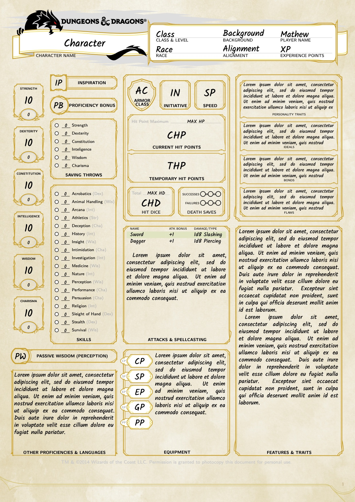
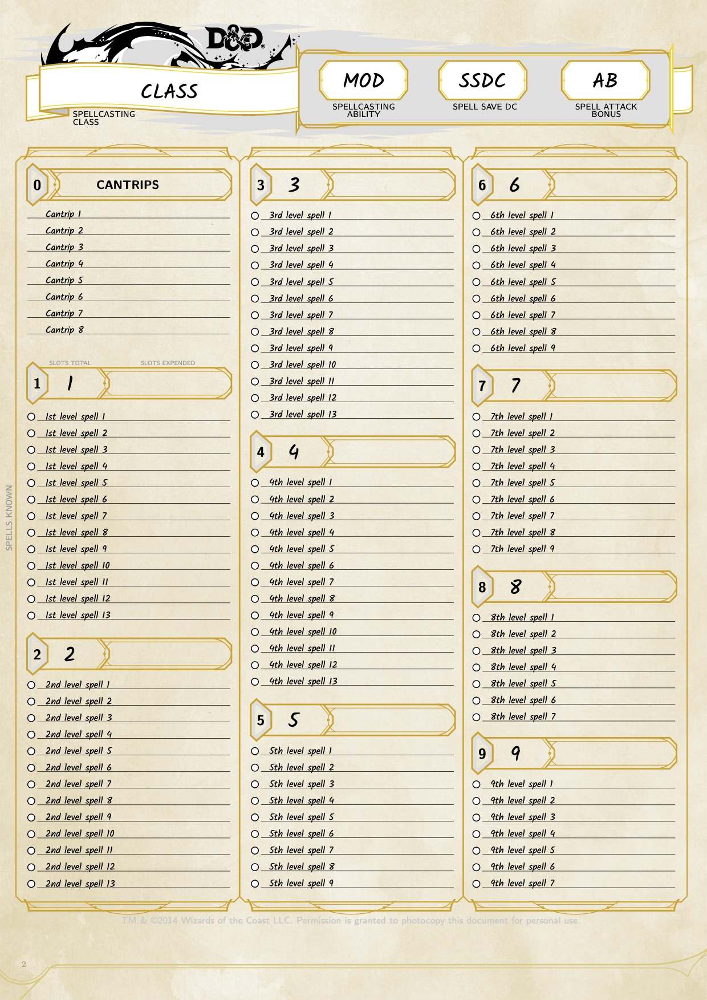

# DND 5e LaTeX Character Template
LaTeX package to typeset character sheets for the fifth edition of the "world's greatest roleplaying game".

## Features
Alows the use of XeLaTeX to generate character sheets for D&D 5e using the official template from Wizards of the Coatst with a wide range of further customisation options.

This package makes use of the [D&D 5e template](https://github.com/rpgtex/DND-5e-LaTeX-Template) which will need to be installed before use.

## Usage
Update the `page-1-player-input.tex` and `page-3-player-input.tex` files to reflect your character, changing proficiney and spell preparedness markers and commenting unused spell slots, and typeset with XeLaTeX.

There are a number of global variables defined at the top of the example page which can be used to modify the color and transparency of a range of objects on the page, allowing them to be hidden.
